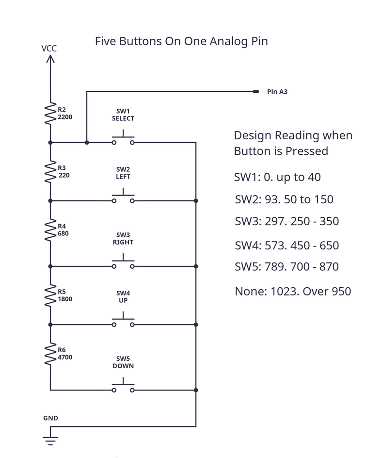

# MultiButtonPin - Five Buttons on One Pin

This example shows a technique for using analog reads on one pin to detect which of several buttons was pressed.

This is the schematic for connecting the buttons and analog pin A3.

NOTE: Instead of connecting the top resistor to VCC (+5V), you could connect it to a digital pin so that the resistor ladder is only powered when you want to read the buttons.