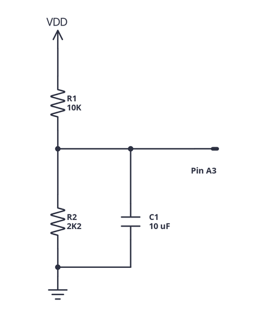

# Test Reading Scatter

"Scatter" is a term for variation in the ADC's result from one read to another of the same input.

## METHOD (in the code)

The idea is to get a number, a "score", for how good the ADC for each combination of **reading method**, **ADC speed**, and **voltage reference**.

There are two voltage references (default and internal; we'll ignore external), three reading methods tested: read(), sleepRead(), and freeRunningMode(), and three speeds: 1x, 2x, and 4x.

The results are printed as two 3 x 3 tables of method x speed, one table for each voltage reference. Each number in a table is the score for that combination of voltage reference, reading method, and speed.

#### Calculating the score for one Vref-Read method-speed combination:

First get an "average" reading. Then for 100 readings, see how much each reading differs from the average, and count the number in each group - same, off by +1, off by -1, etc.

Then calculate a "scatter score" as the weighted sum of the counts x the difference from average. The lower the scatter score the better.

High scatter *probably* shows a problem with your power supply being noisy.  Battery power should give good results with very little scatter.

### Circuit Diagram

For this test you need two resistors of 1K or more in series from +5V to ground, with the junction connected to pin A3 (or whatever analog pin you would  like to use). Stabilise the junction with a capacitor:-

If you choose resistors so that the voltage at the junction is under 1.1 V you can repeat the test using the internal voltage reference.

With the 10K and 2K2 resistors shown in the schematic the voltage is 5V * (2200 / 12200) = 0.902V.  With a 5V reference this should give an ADC reading of 0.902 / 5.000 * 1024 = 184.7, about 185. With a 1.1V internal voltage reference the average reading should be 840.

## EXAMPLE RESULTS

With an Uno clone on USB power:

    Summary tables of scatter scores (lower is better)

    Using Supply as voltage reference
    Method-speed     1x      2x      4x
    read()           53      59      49
    sleepR           34      16      63
    freerun          56      56      78

    Using internal voltage reference
    Method-speed     1x      2x      4x
    read()           13      16       8
    sleepR           38      24       1
    freerun          31      27       8

## USING THE RESULTS

The example results show that higher speed produces lower scatter, especially with the internal voltage reference. There are a couple of points to note, though.

1. This is a  single test of a single unit connected to a particular PC. Results may differ: try to have the test setup as close to your "live" setup as possible.

2. Lower scatter is good: it means that readings are repeatable. But **it does not mean the readings are accurate**. That is a separate test.

### CAUSES OF SCATTER

 The capacitor C1 stabilises the voltage at the junction of R1 and R2,
 so scatter in the readings at A3 arise from (most likely to least likely):-

  1. The power supply (or supplies) for the Arduino and resistors being unstable.
  2. Electrical noise caused by the operation of the CPU affecting the ADC.
     The degree of scatter should not be too bad, mostly + or - 1 count.
  3. An electrically noisy environment (for example fluorescent lights) inducing noise on the input. This is called "interference".
  4. Bad connections. This is surprisingly common and can appear immediately or      after years.
  5. Flaws in the ADC input circuitry that prevent it repeating readings properly.

### FIXES (WE HOPE)

 1. Power Supply. Computer USB sockets and wall-wart power supplies often fluctuate a lot. Batteries are stable and don't inject electrical noise into the circuits they power.
 2. Circuit Noise: To mitigate noise from the CPU, use the sleepRead() function. The CPU is     halted while the ADC works.
 3. Interference: Putting the Arduino inside a metal box and using shielded cables can help reduce external noise. Keep wires twisted together and as short as possible.
 3. Connections: well-soldered connections are best but can still give problems     in tropical environments. Good waterproofing and protection from vibration     and flexing breakage are needed.
 4. ADC fault: Faults in the ADC are very unlikely unless the chip has been damaged by static electricity or overvoltage.
